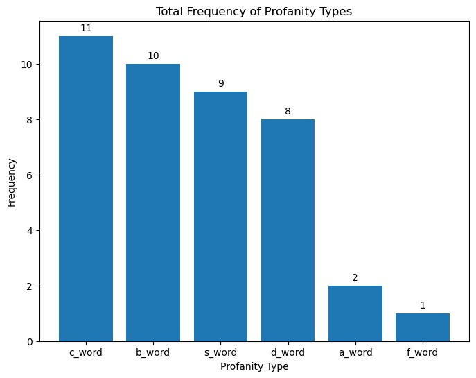
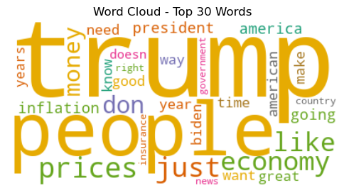
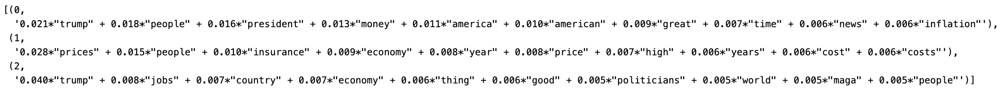
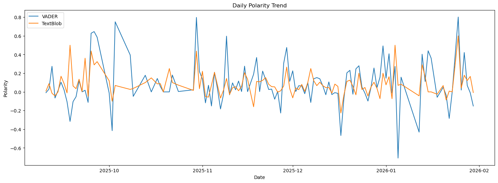

# U.S. Economy Media Discourse Analysis

This project is a multi-stage text mining and discourse analysis workflow built on YouTube content related to the U.S. economy.

Using the YouTube API, I collected economy-related videos and comments from major news channels, transformed the raw comments into an analysis-ready dataset, and applied exploratory text analysis and topic modeling to examine how the economy is discussed in public-facing media spaces.

## Why This Project Matters

Economic news is not just about numbers. It is also about framing, emotion, and public interpretation. People respond to economy-related media through comments that mix everyday financial concerns, political reactions, and broader social sentiment.

This project was designed to move from raw platform data to interpretable discourse patterns through a structured workflow:

1. collect topic-relevant YouTube videos and comments  
2. clean and prepare noisy comment text  
3. analyze vocabulary, tone, and recurring topic patterns  

The result is a portfolio project that combines data collection, text preprocessing, exploratory analysis, and unsupervised text modeling.

## Project Workflow

### Stage 1: Data Collection
- Collected economy-related videos from selected YouTube news channels using the YouTube API
- Filtered videos based on a keyword strategy centered on the U.S. economy
- Extracted video metadata and comment-level engagement data
- Built a structured comment-level dataset for downstream analysis

### Stage 2: Data Preparation and Exploratory Analysis
- Cleaned and standardized comment text
- Compared tokenization strategies for noisy social media comments
- Explored sentiment patterns and lexical signals in the corpus
- Examined how comment language varies across economy-related news discussions

### Stage 3: Topic Discovery and Text Pattern Analysis
- Constructed document-term representations of the cleaned corpus
- Identified the most frequent and salient terms
- Applied topic modeling to uncover recurring discussion themes
- Interpreted broader discourse patterns in economy-related YouTube comments

## Methods and Tools

- **Data collection:** YouTube API  
- **Data processing:** Python, Pandas, NumPy  
- **Text preprocessing:** NLTK, tokenizer comparison, stopword filtering  
- **Text analysis:** document-term matrix, word frequency analysis, topic modeling  
- **Visualization:** Matplotlib, wordcloud  

## Example Outputs

### What vocabulary dominates the comment corpus?


This chart highlights the most frequent words in the cleaned YouTube comment corpus. The results show that economy-related public discussion is closely tied not only to core economic terms such as prices and inflation, but also to politics, leadership, and public reaction.

### Visual summary of the corpus


The word cloud provides a high-level visual overview of the most salient terms in the comment corpus. It complements the frequency-based analysis by making dominant vocabulary patterns easier to interpret at a glance.

### What broader themes appear in the discussion?


This figure summarizes the top terms associated with the discovered topics. The resulting topic structure suggests that economy-related YouTube comments cluster around recurring themes such as cost of living, political-economic evaluation, and broader public or media reactions.

### How does sentiment shift over time?


This visualization tracks sentiment over time across the comment corpus. Rather than showing a single stable emotional direction, the results suggest that audience reactions to economy-related content fluctuate over time and respond to specific events, narratives, and media framing choices.

## Key Findings

- The most common terms in the corpus show that public discussion of the economy is strongly intertwined with politics and media reaction, not just technical economic language.
- Topic modeling reveals that economy-related comment sections are not uniform; they contain multiple recurring themes, including affordability concerns, political evaluation, and broader public commentary.
- Sentiment patterns are dynamic rather than stable, suggesting that economy-related discourse on YouTube is reactive and episodic.
- The project demonstrates that comment sections can be treated as a meaningful source of public discourse data when paired with careful preprocessing and interpretable text analysis methods.

## Repository Structure

```text
us-economy-media-discourse-analysis/
├── README.md
├── .gitignore
├── LICENSE
├── requirements.txt
├── data/
│   └── processed/
│       └── yt_comments.csv
├── notebooks/
│   ├── 01_collect_economy_content.ipynb
│   ├── 02_prepare_and_analyze_comments.ipynb
│   └── 03_topic_and_text_patterns.ipynb
├── assets/
│   ├── frequent_terms_bar.png
│   ├── wordcloud.png
│   ├── topic_terms.png
│   └── sentiment_over_time.png
└── docs/
    ├── project_overview.md
    ├── data_collection.md
    ├── exploratory_analysis.md
    └── topic_modeling.md
